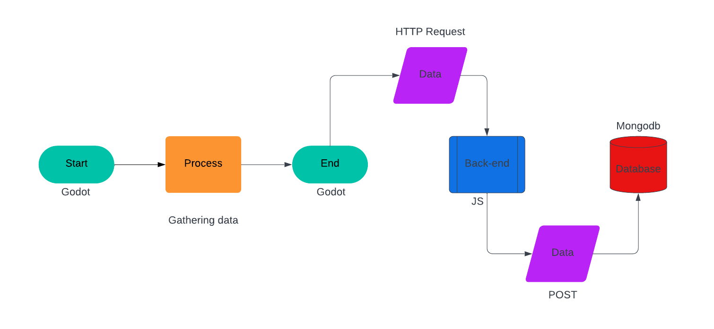

## **docs/dataflow.md**
### **Data Handling Flowchart**
**Description**:
- **Player Data Capture**: The game collects data based on player actions, such as lives lost, coins collected, and time spent.
- **Backend Communication**: This data is sent to an API (Node.js) where it is validated and stored in a MongoDB database.
- **Data Retrieval**: When necessary, aggregated data is pulled from MongoDB and displayed for the user, such as performance metrics after completing a level.

**Flowchart**:
```plaintext
Player Actions -> GameManager -> API Endpoint -> MongoDB (Validation) -> API Endpoint -> Visualization
```



- **Step 1: Player Actions**: Every interaction by the player (e.g., losing a life, jumping, collecting coins) is tracked in the game.
- **Step 2: GameManager**: The game logic is handled here. It processes data and sends it to the API endpoint.
- **Step 3: API Endpoint**: This API receives the data, validates it (e.g., ensuring no invalid entries), and then stores it in the MongoDB database.
- **Step 4: MongoDB**: The MongoDB database stores the validated player data in appropriate collections for future retrieval.
- **Step 5: Data Retrieval**: Data can be fetched from MongoDB to display player stats, such as their performance across levels.
