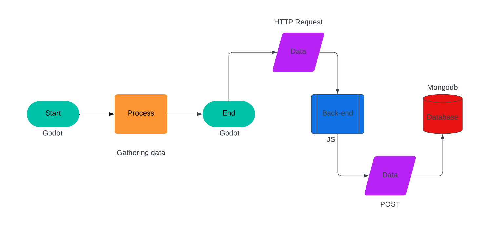

# Project Deliverables

## **docs/conventions.md**
### **Naming Conventions**
- **Files**: All filenames should follow `snake_case` to ensure consistency and readability. This is particularly important in team settings where multiple developers will work on the project. Example: `player_data.gd`, `game_manager.js`.
- **Classes**: Classes should use `PascalCase`, making it easier to distinguish them from functions or variables. Example: `PlayerManager`, `GameManager`.
- **Variables**: Variables are written in `camelCase` for clarity and readability, ensuring that their purpose is obvious at a glance. Example: `playerStats`, `totalCoins`.
- **Constants**: Constants should use `UPPER_SNAKE_CASE` to differentiate them from other variables, signaling that their values should not be modified during the program's runtime. Example: `MAX_LIVES`, `BASE_SCORE`.
- **Functions**: Functions should use `camelCase` as well, maintaining consistency with variables. This helps to identify functions easily within the codebase. Example: `calculateScore`, `savePlayerData`.

### **Folder Structure**
- **Root Directory**:
  - `/assets`: Contains all non-code resources such as images, sound files, animations, and fonts used in the game.
  - `/src`: All source code files, including scripts, logic, and components for the game.
  - `/docs`: Contains all documentation files, including conventions, guides, and technical explanations.
  - `/tests`: Contains all test scripts for validating the game's functionality, including unit tests and integration tests.
- **Subfolders in `/src`**:
  - `/game`: The core game logic folder, containing scripts and files related to gameplay mechanics, player interactions, and level design.
  - `/ui`: Scripts and files for the user interface, such as menus, buttons, and in-game HUD elements.
  - `/api`: Backend integration scripts that handle communication with the server and database.
  - `/utils`: Helper functions and utility scripts that can be used throughout the project (e.g., random number generation, data formatting).

---

## **docs/dataflow.md**
### **Data Handling Flowchart**
**Description**:
- **Player Data Capture**: The game collects data based on player actions, such as lives lost, coins collected, and time spent.
- **Backend Communication**: This data is sent to an API (Node.js) where it is validated and stored in a MongoDB database.
- **Data Retrieval**: When necessary, aggregated data is pulled from MongoDB and displayed for the user, such as performance metrics after completing a level.

**Flowchart**:
```plaintext
Player Actions -> GameManager -> API Endpoint -> MongoDB (Validation) -> API Endpoint -> Visualization
```



- **Step 1: Player Actions**: Every interaction by the player (e.g., losing a life, jumping, collecting coins) is tracked in the game.
- **Step 2: GameManager**: The game logic is handled here. It processes data and sends it to the API endpoint.
- **Step 3: API Endpoint**: This API receives the data, validates it (e.g., ensuring no invalid entries), and then stores it in the MongoDB database.
- **Step 4: MongoDB**: The MongoDB database stores the validated player data in appropriate collections for future retrieval.
- **Step 5: Data Retrieval**: Data can be fetched from MongoDB to display player stats, such as their performance across levels.

---

## **docs/data-visualization.md**
### **Visualization Decisions**
- **Stats to Display**:
  - **Lives Lost**: Shows how many times the player lost a life, categorized by the cause (fall or enemy).
  - **Total Jumps**: Counts the number of jumps the player made during the game.
  - **Time Taken**: Displays the total time it took the player to complete the game or level.
  - **Coins Collected**: Tracks the number of coins the player collected during the game.

- **Visualization Tools**: To make the data easily digestible, bar charts and pie charts are used. These types of visualizations are effective in summarizing multiple values in a compact form.
  - **Bar Charts**: For comparing numerical values (e.g., lives lost vs. coins collected).
  - **Pie Charts**: For displaying proportions (e.g., fall vs. enemy for lives lost).

- **Colors**: Different colors are used to represent each metric to make the charts easy to understand at a glance. For example:
  - **Red** for lives lost.
  - **Yellow** for coins collected.
  - **Blue** for time taken.
  - **Green** for total jumps.

- **Preattentive Attributes**: Critical values are highlighted using size (larger bars/pie slices) and color (brighter, contrasting colors) to immediately draw attention to the most important statistics, helping users quickly assess their performance.

---

## **docs/git-workflow.md**
### **Git Strategy**
1. **Branching**:
   - **feature/**: Used for new features. Example: `feature/level-upgrades`.
   - **fix/**: Used for bug fixes. Example: `fix/game-crash-on-load`.
   - **refactor/**: Used for code improvements without changing functionality. Example: `refactor/game-logic-optimization`.
   
2. **Commit Messages**:
   - Follow the Conventional Commits style for clear and consistent commit messages.
     - `feat`: Adding a new feature (e.g., `feat: add multiplayer mode`).
     - `fix`: Bug fixes (e.g., `fix: resolve issue with jump mechanic`).
     - `docs`: Updates to documentation (e.g., `docs: update README with setup instructions`).
     - `refactor`: Code improvements without changing functionality (e.g., `refactor: simplify game state management`).

3. **Pull Requests**:
   - Pull requests should be submitted when a feature or fix is ready for review. It must be reviewed by at least one other team member before being merged into the main branch.
   - Each pull request should include a description of the changes made and reference any related issues.

4. **Rebasing**:
   - Use `git rebase` to keep the commit history clean before merging changes to the main branch, ensuring that each commit is logically organized and without unnecessary merge commits.

---

## **docs/features.md**
### **Feature Descriptions**
1. **Game Start**:
   - When the game begins, the player is provided with 3 lives. A timer also starts, tracking the time spent on the level.
   - The game initializes all necessary variables and settings.

2. **Game End**:
   - The game ends either when the player loses all 3 lives or successfully completes the level.
   - Once the game ends, all player data (e.g., lives lost, time taken, coins collected) is sent to the backend API for storage in MongoDB.

3. **Player Stats**:
   - The game tracks various player statistics, including:
     - Lives lost (broken down into falls and enemy-related deaths).
     - Total jumps made.
     - Time taken to complete the level.
     - Coins collected.
   - This data is then visualized for the player after each game session.

4. **Backend API**:
   - A backend API handles CRUD operations for player data, ensuring that all player information is stored, retrieved, and displayed efficiently.
   - It is built with Node.js and communicates with MongoDB to store and retrieve data.

---

## **CHANGELOG.md**
### **Version History**
#### v1.0.0
- Initial setup of the game project, including the basic game logic and core mechanics (e.g., tracking lives, jumps, and time).
- Basic API integration with MongoDB for player data storage and retrieval.
- Initial README and documentation files created for project setup and contributing guidelines.

---

## **README.md**
# Game Project

### **Overview**
This is a Godot-based game integrated with a backend using MongoDB. It tracks important player stats, such as lives lost, jumps, and time taken, which are stored in the database for later retrieval and visualization.

### **Setup Instructions**
1. **Clone the Repository**:
   ```bash
   git clone https://github.com/your-repo.git
   ```
2. **Backend Setup**:
   - Navigate to the backend directory:
     ```bash
     cd backend
     ```
   - Install necessary dependencies:
     ```bash
     npm install
     ```
   - Start the server:
     ```bash
     npm start
     ```
3. **Frontend Setup**:
   - Open the Godot project in the editor.
   - Run the project to start playing.

### **Features**
- Tracks player performance metrics, including lives lost, total jumps, time spent, and coins collected.
- The backend stores this data in MongoDB and provides data retrieval for analysis.
- Provides a visualization of player statistics after each session.

### **Contributing**
- Follow the Git workflow outlined in `docs/git-workflow.md`.
- All pull requests must include a description of the changes made and the reasoning behind them.

### **License**
This project is licensed under the MIT License.

### **Documentation**
Refer to the `/docs` folder for more detailed documentation on game features, setup, and development guidelines.
